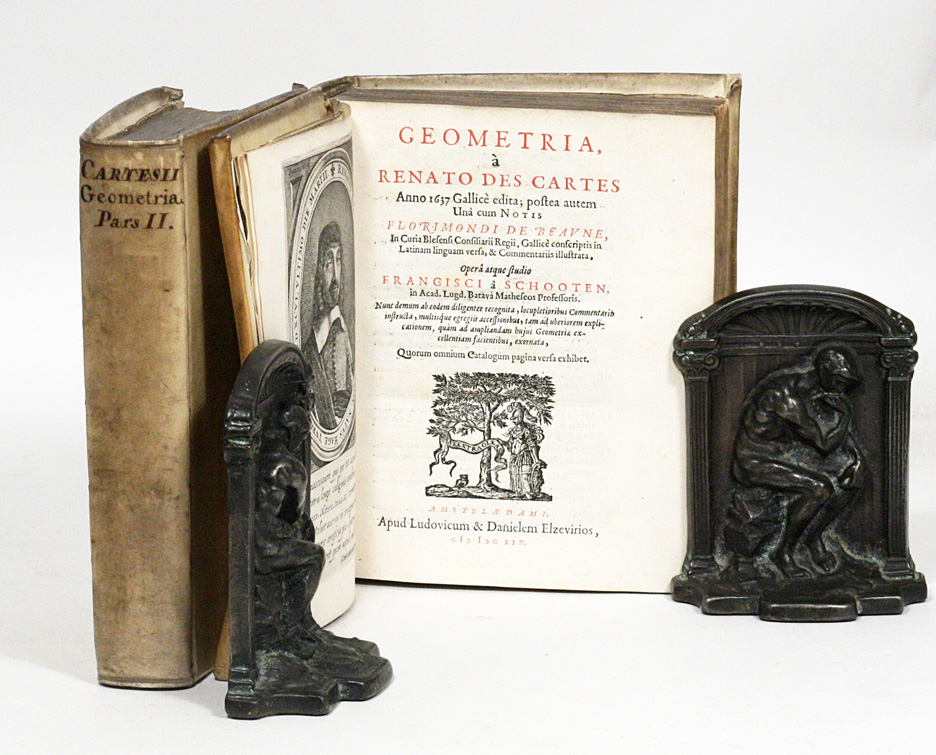

#+TITLE: Try The Mathematical Tripos
#+options: num:nil html-postamble:nil toc:2 
#+STARTUP: showall
#+HTML_HEAD: 

---------------------------------------------------

* Self-studying the tripos

The Cambridge [[https://www.maths.cam.ac.uk/undergrad/lecturelists][Math Tripos]] has existed in some form since the 1700s and the students used to be publicly ranked by exam results so it's really a 300+ year old competition. We have full access to detailed syllabi, archived notes, example sheets (assignments), computational assignments, and exams so can try it ourselves. Any books needed use archive.org, a local [[https://search.worldcat.org/][library]], [[https://annas-archive.org/][Anna's Archive]], or try another 'shadow library' [[https://open-slum.org/][here]].

It is now possible to use the Lean4 proof assistant for books such as [[https://github.com/teorth/analysis][Analysis I]], [[https://github.com/optpku/ReasBook/tree/main/ReasBook/Books/Analysis2_Tao_2022][Analysis II]], [[https://github.com/teorth/analysis/tree/main/Analysis/MeasureTheory][Measure Theory]], [[https://arxiv.org/html/2604.03071][any textbook]] including thousands of formalized theorems in quantum mechanics and cosmology. This means we can do the entire Tripos in Lean4 until we get to [[https://www.youtube.com/watch?v=7oBkEbKJvnE][HoTT]] and can switch to doing 21st century math with types instead of sets. We can also use OpenAI tools.

As a personal interest because I'm a computer scientist I will pursue rational alternatives to everthing learn for two reasons. One is because it's fun to reinvent things yourself and it helps you understand the material. Two is because I have to for my job write software libraries and train LLMs for all these things including physics models and real numbers don't exist on a computer. 

** Isaac Newton at Cambridge

For geometry themed entertainment try [[http://libgen.is/book/index.php?md5=B290F008ACE9DE45827692ED7A4CB944][Isaac Newton on Mathematical Certainty and Method]] by Niccolo Guicciardini.

Isaac Newton entered Cambridge Trinity College in 1661 for it seems a medical degree as a [[https://cudl.lib.cam.ac.uk/view/MS-ADD-03996/1][sub-sizar]] meaning subsidized tuition in exchange for being a domestic servant on campus waiting tables, working in the kitchen, whatever labor that was needed. Cambridge then was just a diploma mill there were seldom any lectures, the oral exams at the end of your degree often were optional, and fellows (graduate students) took jobs as tutors to supplement their income when they weren't getting drunk in nearby taverns. Undergrad curriculums consisted of one of these tutors giving you a list of books to read and that was basically it. According to his Trinity College notebook which Cambridge still has this curriculum was a large reading list of classics such as Du Val's four volume collected works of Aristotle such as /Organon/ and /Metaphysics/, Porphyry's /Isagoge/, Vossius's /Rhetoric/, Diogenes Laertius, Epicurus, Epictetus, Plato, and many Roman poets like Ovid. This was because of the [[https://en.wikipedia.org/wiki/Recovery_of_Aristotle][recovery of Aristotle]] in the middle ages which shaped 'philosophy of natural sciences' courses for the next few centuries. There didn't exist titles like mathematician as practitioners then considered themselves philosophers.

Newton stopped taking notes of his official curriculum and must have read Walter Charleton’s /Physiologia/ because he wrote down 37 headings on different pages that were questions to be answered investigating natural science topics, 18 of which came from Charleton's [[https://archive.org/details/b30323782][book]] and some from Aristotle. These were 'Of Atoms, Of a Vacuum, Of Vision' and many others. He gave each topic different sized gaps indicating how much he thought he needed to write about each. Everytime he would learn something about them he'd write notes under the heading like a comet position he once tracked.

*** How Newton taught himself mathematics ***

According to Newton's [[https://cudl.lib.cam.ac.uk/view/MS-ADD-04000/288][notebook]] and the writings of his close friend De Moivre here is how Newton learned mathematics. Wandering the town fair in 1663 he comes across a book on astrology and out of curiosity of the occult buys a copy. There's a figure he couldn't understand in the book because he didn't know trigonometry. He buys a book on trigonometry but couldn't understand the demonstrations because of a lack of geometry. At Cambridge he goes to the math department and everyone there is deeply immersed in the work of /La Geometrie/ by Descartes. They tell him to read Barrow's "[[https://old.maa.org/press/periodicals/convergence/mathematical-treasures-isaac-barrows-edition-of-euclids-elements][Euclide's Elements]]" which is a 'simplified' version of Euclid's 15 books and Barrow during Newton's first few years is the current [[https://en.wikipedia.org/wiki/Lucasian_Professor_of_Mathematics][Lucasian chair]] at Cambridge. He skims it and after finding what he needs for the astrology/trig book abandons Euclid as 'too trivial demonstrations' only to later to go back and have to relearn classic geometry and writing that he regretted he didn't read Euclid sooner.   

He returns to the math department and is given Oughtred's [[https://www.maa.org/press/periodicals/convergence/mathematical-treasure-oughtreds-clavis-mathematicae][Clavis mathematicae]] or /the key to mathematics/ writing he understands it except for the solutions of quadratic and cubic equations however his takeaway in his notes is that algebra can be used for exploration which he starts doing by writing out hundreds of examples.

#+CAPTION: Cartesian Geometry by Van Schooten [[https://www.manhattanrarebooks.com/pages/books/2043/rene-descartes/geometria?soldItem=true][rarebooks]]
   

Again he returns to the math department and despite being told it was a very difficult book he borrows a 1659 two volume Latin translation of Descartes [[https://en.wikipedia.org/wiki/La_G%C3%A9om%C3%A9trie][La Geometrie]] by van Schooten called /Geometria, a Renato des Cartes/ with appendices and commentary by his students. This book was considered the state of the art of 17th century analytical geometry it would be like reading a graduate text today written by a leading expert that had an appendix full of student written master theses from subject surveys to original research. 

This is the algorithm Newton used to read van Schooten's two volume book. He read a few pages, couldn't understand the text, and went back to the beginning. Went a little further the next time, stopped again and went back to the beginning. He repeats this loop by himself until he finally 'makes himself whole of Descartes'. Looking at the [[https://babel.hathitrust.org/cgi/pt?id=ucm.5320271924&view=1up&seq=24][online copy]] of this 1659 version the Descartes geometry chapter is about 104 pages with 450 or so pages of additional research/commentary. It is broken up into 3 parts and assuming he didn't have to reread each part everytime he looped, only the relevant part (~34 pages), it probably took him 3 months to finish van Schooten which is what his notebook shows that after a few months he was already doing his own research in analytical geometry trying to generalize Descartes. His notebook indicates he learned from the grad student commentaries how to transform a hard problem into a different simpler one. Somewhere around this time he moves dorms complaining his peers were too busy partying so lives with more serious students. This is where the story 'his cat grew fat' comes from as Newton would be up all night studying and forget to eat leaving his plate there untouched so kitty helped himself.

It should be noted that Newton actually hated doing this. He found the math he needed to complete his notebook categories frustrating and so attacked the material not willing to give up. When asked about his early Cambridge habits he said he only got good at mathematics by 'thinking about solving problems night and day'. This is probably where his hatred of algebra and analysis comes from later in life when he laments not learning more classical geometry as to him it was much easier to understand. Imagine what he would think now knowing his calculus is inflicted on all highschool students today in the same way he disliked with poor geometry and tedious calculations being forced on them. 

Newton's notes show him trying to generalize any math he read which often would lead him into algebraic corners where he would get stuck as there didn't exist at the time methods we take for granted now. To Newton all this math was just a means to an end of understanding the natural science topics he originally wrote down as 37 headings in his notes. 

After Descartes he returned the borrowed copy and bought a different copy of Descartes for himself which later has importance, and bought van Schooten's /Exercitationes mathematicae libri quinque/ or Five Books of Mathematical Exercises to help him fill in the blanks of his algebra misunderstandings as he had a lot of mistakes in his notebooks regarding equations ending up as negative roots. Newton assumed the cubic parabola was the same shape in all quadrants but soon after corrected these mistakes. Descartes geometry wasn't like today's Cartesian plane it originally consisted of just one positive quadrant but van Schooten and his students had expanded it. Newton took it to the next level and classified curves into 72 types and sketched them in all four quadrants of the plane. Descartes invented his analytical geometry by watching a fly on a tiled roof move around and thinking about how to describe it's position in that quadrant while trying to solve the problem of Pappus. 

Descartes' /La Geometrie/ was an appendix of his larger book /Discourse on the Method/. That book is about how you would conduct yourself when seeking to make discoveries in the natural sciences and Descartes had filled the appendix with applied examples of using his own method. If you buy a copy of the Discourse today it's likely that none of the appendices are included unfortunately. The geometry appendix is filled with little comments of encouragement as he was afraid nobody would read his work if it was too long so everywhere there is these reassurances like 'don't worry reader the following isn't too hard' or insisting the reader figure out a problem themselves to not deny them of the satisfaction he found by discovering it himself. The different copy Newton buys has all these comments unedited and Newton misunderstands, or the translation from French to Latin is incorrect, one of these comments by Descartes about the equation of curves stating /it is easy/ to find everything you want to know about a curve from it's equation and the reader need not be bothered by a demonstration when in fact this is an unsolved problem and not at all easy. Newton can't figure out this supposedly simple exercise in Descartes' book so breaks down the equation of a curve into many headings in his notebook and begins to generalize which led to him creating his own advanced analysis well beyond any other mathematician at the time or any mathematician for the next 200 years actually. Maybe we should write all textbooks like this "P = NP is trivial for you to figure out therefore a demonstration isn't needed". 

After he reads /Arithmetica Infinitorum/ by Wallis which is the arithmetic of infintesimals. Newton recognizes many of the sums are similar to what he read in Oughtred's book and are known today as Pascal's triangle. In typical Newton fashion he seeks to generalize and invents the binomial theorem. Newton then reads Viete's /Opera Mathematica/ which was another textbook by van Schooten compiling all the works of Viete such as Diophantine equations. In less than a full year Newton managed to bring himself up to date with the entire achievement of mid 17th century mathematics by himself and begins self-directed research writing out 22 headlines of 'problems' in his notebook and classifying them into groups regarding integration, analytic geometry and mechanics. 

In April 1664 Newton has been a subsizar for three years and has to apply for a new scholarship at Trinity College where he first meets the Lucasian Professor Isaac Barrow who examines him on Euclid and finds he knows nothing about classical geometry. Barrow had also worked on infinitesimals and apparently had invented some of calculus himself but not noticed if you read the [[https://archive.org/details/geometricallectu00barr/page/n21/mode/2up][book]] /The Geometrical Lectures of Isaac Barrow/. The author found in Barrow's notes he definitely had a kind of proto-calculus worked out. Newton attends his lectures on Euclid and works through his book and as mentioned earlier laments he didn't begin by studying geometry. An example of this is in his unauthorized published Cambridge lectures /Universal Arithmetic/ where he shows with geometry how imaginary roots must occur in pairs.

The black plague shuts down the school from the summer of 1665 to spring of 1667 and Newton returns home, makes himself an office by building bookshelves for his now large library, and spends all his time doing research with his new analytical tools building them into modern calculus. Describing his activities during the second plague year: "I am ashamed to tell to how many places I carried these computations, having no other business at the time, for then I took really too much delight in these inventions". There is notes he kept of calculating a logarithm to it's 52nd decimal. This is basically the end of the story for Newton's analysis research as sometime during the pandemic years he is satisfied with his binomial theorem and calculus thus abandons research in math to pursue lens making for optics research and the rest of his interests in what we call today classical mechanics. There is a lot of notes about how tedious it was to do calculations by hand before he came up with his analysis so I'm guessing once he had that in his toolkit he was good to go.    

Newton refused to publish any work because of critics and circulated his analysis tools privately. Leibnitz wrote Newton in 1676 asking about his methods for infinite series and if he knew the solution of 'the inverse method of tangents' which we know today as solutions to ordinary differential equations. The response from Newton is lengthy giving a full account on how he had found some of his results then Leibniz replies explaining his differential calculus how he does integrations. Newton also gives a description of his calculus in one of the appendices in his book /Optics/. Every function that accumulates something (volume, area, distance) has a corresponding function somewhere describing the rate of change of how fast said function is accumulating. Today that rate of change is called a derivative and then called a 'differential coefficient' or 'fluxion' by Newton. The undo method of derivatives to get back the original accumulation function is called integration today and was 'the method of quadrature' in Newton's time though we still call it that in numerical analysis. 

20 years later he is offered to write probably the most important technical book every written the /Principia/. Newton knows there is serious foundational issues with infintesimal calculus that critics would pounce onto and he wanted a way to prove his results for readers to understand so he spends 3 years and tries uncovering the ancient analysis used in classical geometry. Pappus' book 7 contains a commentary about the tools and propositions that Euclid, Apollonius, Eratosthenes and other geometers of the day used that Pappus referred to as the 'treasury of analysis'. These were said to be contained in other volumes written by Euclid but those were never recovered. These lost Porisms (corollaries) are speculated by Newton to be [[https://cudl.lib.cam.ac.uk/view/MS-ADD-03963/1][projective geometry]] and he believed the ancients had already figured everything out and this information was lost over time based from his own experience living during the plague, the great fire of London and political upheaval. Newton also solved the problem of Pappus using classical geometry when reading /Collection/ book 7 which was the problem Descartes was working on which led him to invent cartesian analytical geometry in the first place. 

This belief is also what led him to alchemy where he assumed their knowledge was encoded in myths written in Roman and Greek literature writing in his notes that every myth was real but that their lives were embellished through story telling. A common alchemist practice for example was to interpret Ovid's /Metamorphoses/ where the god of the forge/metalwork Vulcan catches his wife Venus and Mars locked in an embrace so traps them in a fine metallic net. The alchemists of the Royal Society that Newton belonged to frequently used the names of planets for metals so obtaining an alchemists manuscript by George Starkey he recreated this myth using it as a recipe and ended up with an alloy with a strided net like surface. Newton also decoded Cadmus and the founding of Thebes from Ovid into practical lab instructions. 

Newton in his Lucasian chair lectures said that the ancients would never bother to introduce the algebra of curves with geometry because you lose the simplicity of working within geometry. He also claims books like Pappus' /Collectio/ deliberately hid the analysis as it was considered an 'inelegant tool' and that ancient synthesis where they deduced a consequence from a given premise (a corollary) using geometric demonstrations was a superior method as the analysis could not be reversed in steps like geometric synthesis could. He went further and claimed if you wanted to discover seemingly unrelated corollaries you had to use synthesis, describing the analysis of his day as a 'tedious pile of probabilities used by bunglers'. 

In other words if he didn't rely on geometry he could not have found most of the critical results of the /Principia/ as most of the proofs in that book did not follow from calculus such as section 12 of Book 1 'the attractive forces of spherical bodies' is entirely derived geometrically. His geometric constuctions of limits using epsilons are very similar to what everyone [[https://www.sciencedirect.com/science/article/pii/S0315086000923012][today]] is using in modern calculus courses. Newton even used an equivalent method to how we would solve differential equations today in a revision of the /Principia/ calculating moon orbit irregularities something that Euler could not solve 70 years later. 

He later wrote in a manuscript on organic geometry that mechanics of motion was what generated all geometry and that the ancients had understood this as well conceiving geometrical objects as generated by moving along a straight edge, circles/elipses via the movement of a compass, or via translation like in Proposition 4 of Book 1 of Euclid's /Elements/ where one triangle form is moved onto another. This is where he demonstrated that rotation of rulers were in fact transformation of the plane. Here is how Newton used his [[https://youtu.be/paenRVq0vnc][rotating ruler]] to create a power series.

In the appendices of his book /Optics/ Newton shows the shadow of a circle cast by a luminous point on a plane generates all the conics, then gives an equation for the shadow of all curves that generate all cubics. He translates these into infinite series for which he has analytical tools and states the importance of determining if these series are convergent which wasn't formalized until the 1800s with Cauchy and Gauss. In the same appendix is the first known use of indices being given to variables. 

If there's time we'll look at his unpublished manuscript the /Geometria/ which was Newton's attempt in the 1690s to write his philosophical views on geometry. 

#+BEGIN_QUOTE
"Comparing today the texts of Newton with the comments of his successors, it is striking how Newton’s original presentation is more modern, more understandable and richer in ideas than the translation due to commentators of his geometrical ideas into the formal language of the calculus of Leibnitz" -[[https://en.wikipedia.org/wiki/Vladimir_Arnold][Vladimir Arnold]] 1990
#+END_QUOTE

*** Newton at the mint

Newton's completely different life that you have never heard about then began at age 52 when he left Cambridge and went on to become both the warden and [[https://newtonandthemint.history.ox.ac.uk/][master]] of the Royal Mint for 30 years a highly lucrative job with enormous bonuses. His warden position was expected to be a no-show patronage gig but he took it seriously and conspired to have all his competition removed as he rose to the top to takeover as the master. He used his alchemy experience to mint high purity coinage often working the royal mint wagies late into the night until they got batches correct and modernized the mint by cracking down on corruption and absenteeism. He personally went after all counterfeiters sometimes dressing up mint employees in disguises to do stings inside of taverns. The mint space was shared with the infantry and he brought with him hired soldiers to interrogate coin clippers and counterfeiters in the streets and you can imagine how those went. Imagine trying to pass your clipped coins to get a pint in the early 1700s and all of a sudden Newton busts in and has his street crew of mercs cave your head in. That is the late stage Isaac Newton we never heard of. 

His [[https://en.wikipedia.org/wiki/Catherine_Barton][niece]] came to live with him in London and was some kind of famous socialite of the time holding many parties at his house with top politicians and actors/poets of the day. Newton would entertain these guests with his expensive cider that he had made buying apple trees from Ralph Austen of Oxford a renowned cider maker and he was famous for wit and performing dramatic demonstrations which Princess Caroline of Ansbach enjoyed so much he was a regular feature of her court. He was not the miserable loner that modern day biographers wish to portray him as. His letters show regular payments and gifts to all extended family members too so he wasn't a scrooge and he didn't die broke either from an [[https://royalsocietypublishing.org/doi/10.1098/rsnr.2018.0018][investment scam]] though he did lose a lot of money. Newton had large mint funds in his possession which was apparently legal to do back then and after the mint funds were removed his estate was worth £30,000 when he died and to see how much that is worth today the average yearly salary of a Surveyor in London then was about [[https://www.pascalbonenfant.com/18c/wages.html][£131]] so he could have employed 229 Surveyors for a single year. Today an average salary for a Surveyor is lowest range ~£60k per year and employing 229 for a year is almost £14 million. He was still insanely rich. 

According to a Cambridge historian who wrote /Life after Gravity/ Newton gave as a dowry to his niece and her future daughter a 200 acre estate which he later moved into when he was dying. He had an elaborate sun dial built in the gardens: 

#+BEGIN_QUOTE
A very curious relic of Sir Isaac survives in the garden at Cranbury Park, a sun-dial, said to have been calculated by Newton. It is in bronze, in excellent preservation, and the gnomon so perforated as to form the cypher I.C. seen either way. The dial is divided into nine circles with the outermost divided into minutes, the next circle divided into hours, then a circle marked "Watch slow, Watch fast," another with the names of places shown when the hour coincides with our noonday, such as Samarcand and Aleppo, etc., all round the world.
#+END_QUOTE

Of an example of how advanced Newton's problem solving was compared to every other analyst at the time was his response to John Bernoulli's [[https://en.wikipedia.org/wiki/Brachistochrone_curve][challenge]]. Bernoulli took 2 weeks to solve it, Leibnitz took six months. Newton solved the problem in a single night after working at the mint and even generalized the second question. Salty historians today say it was exaggerated by his neice who was his personal PR rep but there's a date on the envelope when the solution was mailed back. We will learn these exact problems in this curriculum called the Variational Principles or Calculus of Variations:  

#+BEGIN_EXPORT html
<iframe class="video" src="https://www.youtube.com/embed/qFo7xZFdBdc" title="YouTube video player" frameborder="0" allow="accelerometer; autoplay; clipboard-write; encrypted-media; gyroscope; picture-in-picture" allowfullscreen></iframe>
#+END_EXPORT

-----------------------------

** Vladimir Voevodsky

Vladimir Voevodsky was our modern version of Isaac Newton. He gave absolutely radical lectures at the Institute for Advanced Study about redoing the meaning of equality and shifting the foundations of mathematics to types instead of infinite sets. Voevodsky was a unique mathematician he went to university in Moscow and ignored all his classes preferring to do research on Grothendieck's algebraic geometry so he was kicked out. He wrote groundbreaking papers by himself and showed up to math conferences eventually meeting other experts in the field then wrote so many more papers with other leading mathematicians that one of them invited him to Harvard who just gave him a PhD in 1992. He doesn't have an undergrad. Voevodsky took the most abstract math we have and used it to solve concrete problems in number theory and algebraic geometry so they gave him a Fields medal in 2002. 

While at IAS he ran into a crisis where proofs that were critical to the field were shown to be wrong by minor counter examples. One fix was to replace a single lemma with 30 pages of proofs which noone could verify. He went back to his own work and found mistakes in his own proof and was surprised nobody else had found it. He told a crowd at IAS that modern math was entirely based on reputation and that if you had rep hardly anyone checked your work and if you didn't have rep then your work went unread because it was too much risk to trust the author and too much work to verify pages of proofs. Yes, mathematicians are largely a fraud they never check each other's work and still don't. It's usually some guy in a 3rd world country who uploads a single counter example to Arxiv and then ruins your Harvard thesis. For example if I remember correctly there's this guy in Greece who has a cryptography course for undergrads and all they do is pluck out the assumptions you've made in your proof and find a single counter example, write up an Arxiv paper and poof your work is done. He's been going for years doing this it's hilarious. Daniel J Bernstein also does this routinely and got banned from the IETF crypto working group because after finding flaws in almost every promoted cipher he started accusing everyone of purposely doing this essentially claiming they were [[https://www.youtube.com/watch?v=3Zp1ENClZD8][glowies]]. 

Voevodsky asked around the IAS about the current state of the formalization of mathematics besides set theory and everyone told him it's impossible because of Goedel's incompleteness theorems. Kurt Goedel [[https://lawrencecpaulson.github.io/papers/Russells-mathematical-logic.pdf][blew out]] Bertrand Russell who was writing [[https://en.wikipedia.org/wiki/Principia_Mathematica][Principia Mathematica]] a pile of axioms and symbolic logic on the foundations of math. Godel showed their work was impossible.  

Voevodsky was pointed to Category Theory as a potential to replace set theory. There he found more mistakes and many flaws but correcting them pointed him to discovering Nuprl a 1980s proof assistant and the only 'correct' proof assistant as it's based off Per-Martin Lof's type theory written by Bob Constable and Robert (Bob) Harper. This is where Voevodsky jumps 200 years into the future like Newton and invents Univalence a way to redefine equality and properly base the foundation of mathematics that avoid Goedel's proofs.

Voevodsky's ultimate goal was to have amateur mathematicians like himself be able to contribute to modern research by uploading programs to go with their paper so mathematicians could run them and verify that at least a formalization check was done. It's a revolutionary goal to eliminate the castles in modern math where if you don't have rep you can't get inside the walls. Galois was expelled from school repeatedly and wrote much of his abstract theory while in prison via letters. Today that would never happen that's why Voevodsky has tried to change this.

Voevodsky was known to drink a lot and wander around Boston and he got jumped and robbed by some idiots and badly beaten and was said to never fully recover. These inuries may have lead to his early death. I can relate because in my [[https://youtu.be/9Udjf8vLwHY?si=wDXPSiIgjkt8YB-a][former life]] I also got jumped many times and had my head smashed in but it was     

He died of a brain aneurysm and once gave some wtf interviews to [[https://translate.google.com/translate?sl=auto&tl=en&js=y&prev=_t&hl=en&ie=UTF-8&u=http%3A%2F%2Fweb.archive.org%2Fweb%2F20170826035052%2Fhttp%3A%2F%2Fbaaltii1.livejournal.com%2F198675.html&edit-text=&act=url][Russian bloggers]] (also [[https://translate.google.com/translate?sl=auto&tl=en&js=y&prev=_t&hl=en&ie=UTF-8&u=http%3A%2F%2Fweb.archive.org%2Fweb%2F20120713082116%2Fhttp%3A%2F%2Fbaaltii1.livejournal.com%2F200269.html&edit-text=&act=url][here]]) which you can translate. There he talks about his supernatural hallucinations but they aren't entirely schizo as Karl Jung wrote about the same thing. It's interesting to see a great scientific mind approach this. He had full on hallucinations throwing a ball back and forth. he claims there is AI intelligence (way before AI) and their existence affects humans. Yeah it's crazy this guy was not a garden variety maniac hanging outside 7-11.

*** Proof Assistants

A good modern coverage is [[https://www.youtube.com/watch?v=7oBkEbKJvnE][here]] by Jon Sterling who got his PhD advised by Robert Harper at CMU. He is writing a new classical HoTT proof assistant [[https://tangled.org/jonmsterling.com/swift-pterodactyl/][Pterodactyl]] to challenge Lean4. It's a mainstream proof assistant not an experimental throwaway. We will primarily learn Lean4 of course but eventually we will switch to HoTT proof assistants they are way more powerful. 

* Basic Arithmetic

*** Arithmetic with natural numbers

- [[https://youtu.be/-96tlu_sShM][YouTube]] - Arithmetic and Geometry Math Foundations 2

The successor function s(n) = n + 1 for natural numbers:
- s(0) = 1
- s(s(0)) = 2
- s(s(s(0))) = 3

Let's prove the laws of multiplication using his definitions

*Prove n * 1 = n*

The definition of multiplication: mn is n + n repeated m times so n1 is 1 + 1 repeated n times so 1_1 + 1_2 + ... + 1_n = n

We will need this result for the other proofs.

*Prove the distributive law: (k + n)m = km + nm*

km is m + m repeated k times or m_1 + ... + m_k and (k + n)m means m + m repeated (k + n) times. Distributing m in (k + n)m we get: ((m_1 + m +...m_{k}) + (m_1 + m +...m_{n})) and now the left side matches the right side since km + nm is the same when expanded.
  
*Prove the associative law: (kn)m = k(nm)*

(kn)m is m + m repeated kn times and kn is n + n repeated k times:

(n_1 + ... + n_{k})m or (mn_1 + ... + mn_{k}) using distributive law. 

Right hand side: k(nm) is nm + nm repeated k times (nm_1 + ... + nm_{k}) and factor out m, both sides of the equation are the same since we haven't proven the commutative law yet so can't claim nm sequence is the same as mn sequence.  

*Prove the commutative law: nm = mn*

First let's prove n1 = 1n or 1n = n. We proved n1 = n already, so we can use substitution to replace n in 1n with 1(1_1 + .. + 1_{n}) and using the distributive law this is (1_1 + .. + 1_{n}) or n. Now we have n1 = 1n.

Looking at the right side: mn is (n_1 + ... + n_{m})

Factor out n: n(1_1 + .. + 1_{m}) and a sum of 1's up to m is m, we have nm = mn.  

*** Subtraction and division

- [[https://youtu.be/mVd202X-2uM][YouTube]] - Arithmetic and Geometry Math Foundations 4

Try the subtraction laws assuming n > m 

- n - (m + k) = (n - m) - k 
 - The left side is n + (-1)(m + k)  
 - (-1)(m + k) via distributive law is (-1)m + (-1)k 
 - (-1)m is m + m groups at -1 times which makes no sense so we can commute
 - m(-1) now it's m copies of -1 
 - n + (-1_1 + -1_2 .. + -1_{m}) is -1 added up m times or -m 
 - n - m + (-1_1 + -1_2 .. + -1_{k}) is -1 added up k times or -k
  - n - m - k = n - m - k

*** The Hindu-Arabic number system 

- [[https://youtu.be/wbz4Af_TngM][YouTube]] - Arithmetic and Geometry Math Foundations 6 

A simplified Roman numeral system is introduced 
- Uses powers of 10 
 - 327 = 3 x 10^2 + 2 x 10^1 + 7 x 10^0     

*** Arithmetic with Hindu-Arabic notation

- [[https://youtu.be/JA2XBgg_iB8][YouTube]] - Arithmetic and Geometry Math Foundations 7

A new way of hand multiplication is shown, taking advantage of the fact the notation is using the distributive law. Borrowing while doing hand subtraction now makes sense. Wildberger rants how his daughter was taught a ridiculous way in the questionable Australian 'modernized' school system. 

*** Laws of Division

- [[https://youtu.be/WiYKyjQNUm0][YouTube]] - Arithmetic and Geometry Math Foundations 8

Wildberger says he didn't find any long division content in his kid's curriculum because schools removed it claiming it was too difficult.  Another way to do long division:

#+BEGIN_EXAMPLE
7)203
#+END_EXAMPLE

How many groups of 7 x 10^2 fit into 203? 0 so reduce to how many groups of 7 x 10^1 fit into 203? 20 

#+BEGIN_EXAMPLE
   20  
7)203
 -140
   63  
#+END_EXAMPLE

How many groups of 7 x 10^1 fit into 63? 0 so reduce to how many groups of 7 x 10^0 fit into 63? 9 

#+BEGIN_EXAMPLE
   29
7)203 
 -140
   63
  -63
#+END_EXAMPLE

*** Fractions
   
- [[https://youtu.be/50-GsMX7pjQ][YouTube]] - Arithmetic and Geometry Math Foundations 9 

Interesting how he defines all these as types.

*** Arithmetic with fractions

- [[https://youtu.be/5PxUNiHaOLA][YouTube]] - Arithmetic and Geometry Math Foundations 10

The prime [[https://en.wikipedia.org/wiki/Prime_(symbol)][notation]] used in the proof represents another variable with the same type.

*** Laws of arithmetic for fracions

- [[https://youtu.be/uADs1yepIIA?feature=shared][YouTube]] - Arithmetic and Geometry Math Foundations 11

More simple proofs.  

*** Integer construction

- [[https://youtu.be/YDBLXCFrihc?feature=shared][YouTube]] - Arithmetic and Geometry Math Foundations 12

The point in watching these is to see how you can start with just the natural natural numbers and keep going defining more and more complexity with new types of numbers like integers. 

*** Rational numbers

- [[https://youtu.be/MDMG9Ljb8l0?feature=shared][YouTube]] - Arithmetic and Geometry Math Foundations 13

We learn what a field is. If you're curious in the introduction [[https://youtu.be/83ZjYvkdzYI?feature=shared][here]] he shows how the rational number line has been raised on the y-axis showing how all numbers on a line through the origin (0,0) are equal on the rational strip. It explains why a/1 is a and why a/0 is not defined.

Notice how a single object like a/b as many interpretations if it's 1/2 * 25 that means a rate or for every 2 in 25 take 1. It can also represent a fraction like 1/2 of a quantity. It can also represent a decimal in a different form.   

If for whatever reasons you want even more arithmetic try [[https://www.mathasasecondlanguage.org/self-guided][Arithmetic]] by Herb Gross. This is vocational school style math that was originally taught to adults at community colleges and in prisons in North Carolina. The book is [[http://web.archive.org/web/20170713214904/http://www.adjectivenounmath.com/id78.html][here]] archived and the YouTube [[https://www.youtube.com/playlist?list=PL9phnVI_EOVW9U2PZtGKRwMvHy3l4reYv][playlist]] has exercise explanation videos you don't have to watch unless needed but they're very good he teaches everything using bounds and inequalities or relating concepts to English grammar. A free resource for practice is [[https://www.expii.com/][expii]] it was designed by the US olympiad national coach [[https://www.math.cmu.edu/~ploh/cmu.shtml][Poh-Shen Loh]]. We will do so many problems however in the tripos that you will pick this all up anyway. 

* Basic Geometry

I'll go through [[https://ocw.metu.edu.tr/course/view.php?id=311][MATH 373]] and learn Greek geometry in part IA of the Tripos there's a playlist on [[https://www.youtube.com/playlist?list=PLuiPz6iU5SQ828B8vmWXrjMDGXHGH3ci6][YouTube]]. 

Euclid's Elements basic rundown:

- [[https://www.youtube.com/watch?v=yICpKzPv1xI&list=PL5A714C94D40392AB&index=19][YouTube]] - Arithmetic and Geometry Math Foundations 19
- [[https://www.youtube.com/watch?v=YAdEfQsIGt8&list=PL5A714C94D40392AB&index=20][YouTube]] - Arithmetic and Geometry Math Foundations 20
- [[https://www.youtube.com/watch?v=ucczpxEySno&list=PL5A714C94D40392AB&index=21][YouTube]] - Arithmetic and Geometry Math Foundations 21

This used to be taught in middle schools and students had to demonstrate proofs from the book to the class which is how computer scientist Robert Harper said he first learned mathematical logic or proofs. Euclid himself said these books were to prepare philosophers with deductive reasoning. US President Lincoln also read Euclid (including the very abstract book V and number theoretical book VII) claiming he was embarassed by not having any formal education: 

#+BEGIN_QUOTE
"He studied and nearly mastered the Six-books of Euclid (geometry) since he was a member of Congress. He began a course of rigid mental discipline with the intent to improve his faculties, especially his powers of logic and language. Hence his fondness for Euclid, which he carried with him on the circuit till he could demonstrate with ease all the propositions in the six books; often studying far into the night, with a candle near his pillow, while his fellow-lawyers, half a dozen in a room, filled the air with interminable snoring."- Abraham Lincoln from Short Autobiography of 1860
#+END_QUOTE

* Basic Algebra 

Algebra as we know it today was invented 1200 years ago as a 'system of balancing' to figure out complex Islamic inheritance law and being able to eliminate negative numbers because back then a negative number made no sense whatsoever. Before that Diophantus wrote several treatises on a kind of algebra that was also invented to solve Athenian legal procedures about dividing of estates between family members. Diophantus teaches the reader how to solve problems giving examples of potential mistakes and dead ends which to me is very unusual (and helpful). If you're interested read /Brill's Companion to the Reception of Ancient Rhetoric/ chapter 26 /The Rhetoric of Math/ via library genesis or try a [[https://polymathclassical.com/curriculum-diophantine-algebra/][course]] in Diophantine Algebra.

A difference between arithmetic and algebra is in arithmetic everything is a known quantity and in algebra we have unknows we are trying to figure out. 

- [[https://www.youtube.com/watch?v=oN5kw9i7qTA][YouTube]] - Arithmetic and Geometry Math Foundations 47
- [[https://www.youtube.com/watch?v=7eZUzceFFJw&list=PL5A714C94D40392AB&index=49][YouTube]] - Arithmetic and Geometry Math Foundations 48a 
- [[https://www.youtube.com/watch?v=mrY0mr1kGc0&list=PL5A714C94D40392AB&index=50][YouTube]] - Arithmetic and Geometry Math Foundations 48b
 - These 3 vids are the absolute basics of algebra and solving a quadratic equation
- [[https://www.youtube.com/watch?v=h0Woqc_5qUE&list=PL5A714C94D40392AB&index=56][YouTube]] - Arithmetic and Geometry Math Foundations 54
- [[https://www.youtube.com/watch?v=9txb9FgLDNY&list=PL5A714C94D40392AB&index=57][YouTube]] - Arithmetic and Geometry Math Foundations 55
 - Binomial theorem/coefficients (n choose k)

* Basic Calculus

The gist of calculus is a function describing something that accumulates (interest, income, volume, area, distances) will always have a corresponding function that describes the rate of change of said accumulation. These 2 functions can be switched back and forth you derive a new function and then integrate to get back the original function.

We will learn calculus in Part IA.

* Vladimir Voevodsky

Vladimir Voevodsky gave absolutely radical lectures at the Institute for Advanced Studies about redoing the notion of equality and shifting the foundations of mathematics to types instead of sets. Voevodsky was a unique mathematician he went to university in Moscow and ignored all his classes preferring to do research and was kicked out. By himself he wrote so many groundbreaking papers that Harvard just gave him a PhD in 1992 where the same year he presented his dissertation on algebraic topology and soon was awarded the Fields medal.  

A good modern coverage is [[https://www.youtube.com/watch?v=7oBkEbKJvnE][here]] by Jon Sterling who got his PhD advised by Robert Harper at CMU. He is writing a new classical HoTT proof assistant [[https://tangled.org/jonmsterling.com/swift-pterodactyl/][Pterodactyl]] to challenge Lean4. It's a mainstream proof assistant not an experimental throwaway. 

* Mathematical Tripos 

** How it works

The Tripos consists of Part IA, IB and II and is supposed to take 3 years to achieve a BA honors degree. It is a fully immersive degree where all you do is math 6 days a week there is no other electives. Each year has 3 terms that are 80 days long: Michaelmas, Lent and Easter. Each term is 3-5 courses of 24 lectures (or 6-7 if you are going hard) each except Easter where [[https://www.maths.cam.ac.uk/undergrad/catam/part-ia-lectures][computational projects]] are done and the exams. This is why it's considered a very hard degree because imagine taking a dozen courses and having to know them so well that you can pass a series of 3 hour tests months later. 

During the term you work through 4 example sheets per course. These are usually due every 6 lectures and attending lectures is optional some just read the notes and work through the recommended books. Each course has around 4-10 recommended books. There's no TAs, no recitations, no midterms, no office hours, the only time you get personalized instruction is during supervision where your example sheet is reviewed and you can ask questions. This is perfect for self-studying. 

** Curriculum

Here is the [[https://www.maths.cam.ac.uk/undergrad/files/schedules.pdf][schedule]] and this almost never changes from year to year, I'm looking at the 2025/2026 schedule. Each year the tripos [[https://www.maths.cam.ac.uk/undergrad/lecturelists][publishes]] their curriculum and sometimes professors post lecture notes on their personal sites or by students like [[https://thirdsgames.co.uk/maths.html][here]] or [[https://www.neelnanda.io/about][Neel Nanda's]] notes. Here is a sample recorded [[https://www.youtube.com/watch?v=71lsEVpKM88][lecture]]. 
 
*** Part IA 
Part IA we don't get a choice in courses. Cambridge allows students to sit in on any lectures they want so often students attend 1B Groups/Rings lectures to fill in the theory. 

- Michaelmas
  - Vectors/Matrices
  - Differential Eq w/basic calculus
  - Groups
   - Usually 8 extra lectures of 1B Groups
  - Numbers and Sets
  - Mechanics refresher (no exam)
- Lent
  - Analysis I
  - Probability
  - Vector Calculus
  - Dynamics
- Easter 
 - Variational Principles (examined next term)
 - Computational Projects [[https://www.maths.cam.ac.uk/undergrad/catam/part-ia-lectures][here]] 
 - Exams for all courses taken in Michaelmas and Lent

You will see an option for physics students but you can ignore it as I will be taking physics. What it means is someone foolish enough to take the math tripos physics track can substitute these courses with the natural sciences tripos instead to see if they actually want to take mathematical physics in the pure math tripos. It's Cambridges way of saying 'are you sure you want to inflict this on yourself'.    

*** Part IB 
If you drop one of these make sure not to break dependencies for Part II courses you want to take according to the [[https://www.maths.cam.ac.uk/undergrad/files/schedules.pdf][schedule]]. 

- Michaelmas
 - Linear Algebra
 - Analysis and Topology which we have to take in Part 1A
 - Methods
 - Quantum Mechanics
 - Markov Chains 
- Lent
 - Groups, Ring, Modules
 - Geometry
 - Complex Analysis
 - Statistics
 - Electromagnetism
 - Fluid Dynamics 
- Easter
 - Optimisation (examined next term)
 - Computational Projects
 - Exams for all courses taken in Michaelmas and Lent 

*** Part II 

Choose ~8 courses you're interested in. Whatever you will need for part III you take here too.

We can try Classical Mechanics and Differential Geometry to do Sussman's two books [[http://groups.csail.mit.edu/mac/users/gjs/6946/index.html][Structure and Interpretation of Classical Mechanics]] and [[https://mitp-content-server.mit.edu/books/content/sectbyfn/books_pres_0/9580/9580.pdf?dl=1][Functional Differential Geometry]] which is some more computational projects. His book uses the material learned in Variational Principles. 

Modern physics is mostly numerical analysis speeding up models and continuum mechanics like fluid dynamics because theoretical cosmology will model the universe as some kind of continuous fluid that varies spatially. Quantum computing is also moving from vaporware and simulations to possibly real life computers (on the dark side of the moon where it's low enough temp) so we can take that too as there is quantum algorithms, post-quantum cryptography, lot's of work being done right now. I fully plan on taking quantum mechanics and fluid dynamics.   

*** Part III (Masters)

List of courses [[https://www.maths.cam.ac.uk/postgrad/part-iii/part-iii-guide-courses][here]] and we have access to the [[http://www.dpmms.cam.ac.uk/study/#PartIII][example sheets]] for most topics. You get 9 months of instruction taking up to 5-7 graduate courses depending if they are 24 lectures or 16 lectures and are [[https://www.maths.cam.ac.uk/postgrad/part-iii/current/tripos-examination-papers/2023][examined]] in Easter term. Only 5 courses are examined and you attempt 3 questions. They allow you to write a summary paper roughly 30 pages long of the subject to replace having to do a 3 hour exam on that course. This is similar to first year grad school for PhDs in North America except there is usually an [[https://web.math.princeton.edu/generals/conrad_brian][oral exam]] with multiple examiners to see where you currently stand. 

If you actually make it to Part III some of the subjects are available to us such as [[https://www.maths.cam.ac.uk/postgrad/part-iii/algebraic-geometry-courses][Algebraic Geometry]] and commutative algebra lecture content is [[https://www.youtube.com/@richarde.borcherds7998/playlists][here]]. It has applications in cryptography with error correcting codes, complexity theory, anywhere there exists a polynomial space. Some of the other subjects have equivalent free resources like the [[http://www.damtp.cam.ac.uk/user/ep551/teaching.html][lecture notes]] in Cosmology but we're a long, long way from part III we'll just see what's available when we get there. Part III is more like the old school tripos where it was a marathon even their own guide for Part III says you won't understand the lectures at the pace they are given and are expected to put in your own work to figure it out. 

* Part 1A 

According to the [[https://www.maths.cam.ac.uk/undergrad/files/schedules.pdf][schedule]] for term 1 (Michaelmas) there is 4 mandatory courses of 24 lectures and if we don't have 'A-levels mechanics' we are supposed to take a crash course in classical mechanics.

** Michaelmas 
We take these all at the same time: 

- [[./numbersandsets.html][Numbers and Sets]]
- [[./groups.html][Groups]]
- [[./vectors.html][Vectors and Matrices]]
- [[./differential.html][Differential Equations]]
 - we learn calculus here 
- [[./mechanics.html][Mechanics]]

*** Study skills

Students arriving in October are given [[https://www.maths.cam.ac.uk/undergrad/files/studyskills.pdf][this]] leaflet on study skills in mathematics. In [[https://gowers.wordpress.com/2011/09/23/welcome-to-the-cambridge-mathematical-tripos/][this]] post /Welcome to the Cambridge Mathematical Tripos/ he recommmends we try and prove it all ourselves such as whenever we come across a Lemma in a book guess what it will be used for then try and prove it before reading further. Don Knuth suggests the same thing saying when you get to the end of a page in a math book try and guess what the topics on the next page will be. Think about what you're learning. 

** Lent
- [[./vectorcalc.html][Vector Calculus]]
- [[./analysis1.html][Analysis I]]
- [[./probability.html][Probability]]    
- Dynamics and Relativity
 - Prof David Tong's [[http://www.damtp.cam.ac.uk/user/tong/relativity.html][page]]

TODO 

** Easter

- Variational Principles (examined next year)

Very good [[https://www.damtp.cam.ac.uk/user/examples/B6La.pdf][lecture notes]] and this is what Sussman uses for his book [[https://groups.csail.mit.edu/mac/users/gjs/6946/sicm-html/book.html][SICM]] which we'll do once we get to Part 1B and take classical mechanics. This material is examined the next year in Part IB.  

- Computational Projects
- Exams
 - All are [[https://www.maths.cam.ac.uk/undergrad/pastpapers/past-ia-ib-and-ii-examination-papers][here]] and they test both Michaelmas and Lent courses. 

* Part 1B TODO
* Part II TODO

------------------------
[[./index.html][Home]]
